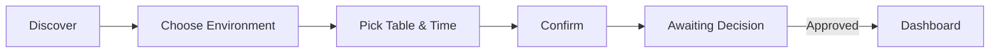
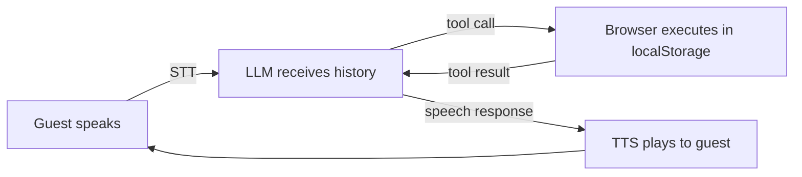

# Spotly — Presentation Script
> Format: each slide is separated by `---`. Content is what goes ON the slide.
> Lines starting with `>` are speaker notes / transitions, not slide content.
> `[IMAGE]` blocks tell you exactly what to place and where to find it.

---

## Slide 1 — Welcome

**SPOTLY**
*Luxury Venue Discovery and Booking Platform*

- Cyrine Krichen
- Eya Sassi
- Lina Khemiri
- Youssef Ben Jemaa

Supervisor: Mr. Amine Ben Hassouna
Mediterranean Institute of Technology — ISS296 — Spring 2026

[IMAGE: Top-left — MedTech logo (LogoMedTech.png)]
[IMAGE: Center or top — Spotly wordmark / app logo]

---

## Slide 2 — Overview

1. Analysis & Requirement Specification
2. Planning
3. Software Design
4. Project Implementation
5. Demo
6. Conclusion

---

## Slide 3 — Chapter Divider

# Chapter 1
## Analysis & Requirement Specification

---

## Slide 4 — The Problem

**It's Friday evening.**
You want to book a table at a luxury rooftop bar.

Your options:

- Call the venue and wait on hold
- Fill out a generic form that could be for a dentist's office
- Scroll through platforms that show no sense of the venue's identity

**The experience hasn't caught up with the venues.**

---

## Slide 5 — Our Solution

**Spotly** is a luxury venue discovery and table booking platform — built to feel as premium as the venues it lists.

- **Discovery** — browse, filter, or describe your mood in natural language
- **Booking** — visual floor plan, real-time availability, multi-step flow
- **Operations** — complete management suite for admins and on-shift staff

**Target users:** Clients · Venue Admins · Staff

---

## Slide 6 — Role: Guest

**Who:** Any unauthenticated visitor

- Browse all venues on the home page — no account needed
- View any venue's full public profile: photos, description, reviews, ambience tags
- Scan a table's QR code to access the digital menu
- Use AI semantic search to describe a mood and get matched venues

> The least privileged role — but the entry point for every new user.

---

## Slide 7 — Role: Client

**Who:** Any authenticated user who is not an admin or staff

- Complete the full booking flow: environment → floor plan → confirm → await decision
- Track reservation status in real time — timeline updates the moment the admin acts
- Manage bookings from the client dashboard: upcoming, past, cancel
- Submit a review after a completed visit
- Book through a voice conversation — no form filling

---

## Slide 8 — Role: Admin

**Who:** The user whose email matches a venue's admin email

- Onboarding wizard to set up the venue before the dashboard unlocks
- Dashboard with live KPIs: reservations today, pending count, no-show rate
- Floor plan builder — drag, place, resize, and rotate tables on a visual canvas
- Full menu management with category filters and availability toggles
- Reservation queue — approve or reject with filters by status, date, environment
- Review moderation, QR code generation, venue identity settings
- AI-generated insights on booking patterns with a 7-day outlook tab

---

## Slide 9 — Role: Staff

**Who:** A user assigned to a venue by the admin via a VenueStaff record

- Live floor map — every table's state at a glance for the selected shift
- One-tap check-in, no-show marking, and guest checkout
- Walk-in creation for unbooked arrivals directly from the floor map
- Real-time waiter call alerts — acknowledge from the map

---

## Slide 10 — Chapter Divider

# Chapter 2
## Planning

---

## Slide 11 — Planning

**Two phases. One semester.**

| | Phase 1 — Core | Phase 2 — AI |
|---|---|---|
| **When** | Jan → Apr 2026 | Apr → May 2026 |
| **What** | Learning, data model, all 20 core features | 3 AI features built on the finished platform |

**Cyrine** — Floor plan builder · Venue settings · Admin onboarding
**Eya** — Auth · Booking flow · Client dashboard
**Lina** — Design system · Admin dashboard · Menu · QR · Staff dashboard
**Youssef** — Data model · Discovery · Reservation queue · Reviews · All AI

---

## Slide 12 — Chapter Divider

# Chapter 3
## Software Design

---

## Slide 13 — Navigation Diagram

[IMAGE: Full slide — `spotly/docs/submissions/nav.png`]

**Routes are grouped by role:**

- **Public** — landing, home, venue profile, digital menu (accessible to all)
- **Booking flow** — 3-step flow + awaiting screen (client only, sequential)
- **Client dashboard** — reservations and review submission
- **Admin panel** — dashboard + 6 management pages behind a role guard
- **Staff dashboard** — live floor, separate from admin
- The voice call modal overlays the home page — it is not a separate route

---

## Slide 14 — Sketching: Landing Page

*Visualizing scenario S2 — New Client Registers and Completes a Booking (step S2.1)*

*S2.1 — Guest opens the application and lands on the landing page.*

[IMAGE LEFT: `spotly/e2e/wireframes/sketches/P01_Landing.jpeg`]
[IMAGE RIGHT: actual app screenshot — landing page]

The entry point was clear from day one: one headline, one call to action.

---

## Slide 15 — Sketching: Authentication

*Visualizing scenario S2 — New Client Registers and Completes a Booking (step S2.2)*

*S2.2 — Guest fills in their details and registers. A session is created and they become a Client.*

[IMAGE LEFT: `spotly/e2e/wireframes/sketches/P02_Auth.jpeg`]
[IMAGE RIGHT: actual app screenshot — authentication page, register tab]

Single page, two modes — register and login — decided in the sketch before any form was built.

---

## Slide 16 — Sketching: Home Page

*Visualizing scenario S2 — New Client Registers and Completes a Booking (step S2.3)*

*S2.3 — Client searches for a venue by name using the search bar.*

[IMAGE LEFT: `spotly/e2e/wireframes/sketches/P03_Home.jpeg`]
[IMAGE RIGHT: actual app screenshot — home page with search bar active]

The AI discovery toggle also appears here — it was already in the sketch at this stage.

---

## Slide 17 — Sketching: Venue Profile

*Visualizing scenario S2 — New Client Registers and Completes a Booking (steps S2.4–S2.5)*

*S2.4–S2.5 — Client opens the venue profile and clicks Book a Table to start the flow.*

[IMAGE LEFT: `spotly/e2e/wireframes/screenshots/P04_VenuePublicProfile.png`]
[IMAGE RIGHT: actual app screenshot — venue public profile with photos, reviews, and Book a Table button]

The profile had to sell the venue before the client committed to booking.

---

## Slide 18 — Sketching: Environment Selection

*Visualizing scenario S2 — New Client Registers and Completes a Booking (step S2.6)*

*S2.6 — Client views available environments and selects one.*

[IMAGE LEFT: `spotly/e2e/wireframes/screenshots/P07_BookingEnvironment.png`]
[IMAGE RIGHT: actual app screenshot — booking step 1, environment cards]

Choosing the environment before the table keeps the floor plan focused and unambiguous.

---

## Slide 19 — Sketching: Floor Plan

*Visualizing scenario S2 — New Client Registers and Completes a Booking (step S2.7)*

*S2.7 — Client views the floor plan, picks an available table, and selects a date and time.*

[IMAGE LEFT: `spotly/e2e/wireframes/screenshots/P08_BookingSeats.png`]
[IMAGE RIGHT: actual app screenshot — booking step 2, floor plan with available and occupied tables]

Table status is never stored — it is computed from reservations at render time.

---

## Slide 20 — Sketching: Confirm & Await

*Visualizing scenario S2 — New Client Registers and Completes a Booking (steps S2.8–S2.9)*

*S2.8–S2.9 — Client submits the reservation and is redirected to the awaiting screen.*

[IMAGE LEFT TOP: `spotly/e2e/wireframes/sketches/P09_BookingConfirm.jpg`]
[IMAGE LEFT BOTTOM: `spotly/e2e/wireframes/sketches/P10_BookingAwaiting.jpg`]
[IMAGE RIGHT: actual app screenshot — awaiting screen, timeline in "Under Review" state]

The timeline moves the moment the admin acts — no page refresh, no polling.

---

## Slide 21 — Data Model

[IMAGE: Full slide — `spotly/docs/submissions/class.png`]

**Key design decisions:**
- 8 entities — User, Venue, Environment, MenuItem, Reservation, Review, VenueStaff, WaiterCall
- Roles are not stored — Admin and Staff are derived at runtime from relationships
- Element status is never persisted — computed from reservations at render time

---

## Slide 22 — Chapter Divider

# Chapter 4
## Project Implementation

---

## Slide 23 — Hardware Environment

Four machines — 3 Windows laptops, 1 MacBook Pro M1.

| Member | Machine | CPU | RAM |
|---|---|---|---|
| Cyrine | HP Laptop | Intel Core i7 | 32 GB |
| Eya | Lenovo IdeaPad 3 | Intel Core i3 | 8 GB |
| Lina | Lenovo ThinkPad | Intel Core i7 | 8 GB |
| Youssef | MacBook Pro 2020 | Apple M1 | 8 GB |

---

## Slide 24 — Software Environment

| Tool | |
|---|---|
| IDE | Visual Studio Code — Volar + ESLint |
| Browser | Chrome (dev) · Firefox (validation) |
| Version Control | Git + GitHub |
| Build | Vite 5 + npm |

---

## Slide 25 — Technological Choices

**Core stack**
Vue.js 3 + Vuetify 3 + Vite 5 — reactive components, Material UI with a custom gold palette, sub-second builds

**Routing & imports**
`unplugin-vue-router` (file-based routes) · `unplugin-vue-components` (auto-import — no manual import statements)

**Data & media**
`localStorage` + native `storage` event for cross-tab reactivity · Cloudinary for venue photo CDN

**AI layer**
Groq API (LLM inference, ~300–700ms/turn) · ElevenLabs (neural TTS, falls back to SpeechSynthesis) · Web Speech Recognition API (browser-native STT)

---

## Slide 26 — The Pivot

**Phase 1 was done.**

**We kept going.**

---

## Slide 27 — Advanced Technologies: AI Features

**Three features. All unplanned. All shipped.**

**🔍 Semantic Venue Discovery**
Describe a mood in natural language → AI ranks matching venues and gives a one-line reason per match

**📊 Reservation Insights**
Admin clicks Generate → AI reads 30 days of booking data → returns 3–5 actionable observations with severity indicators and a 7-day outlook tab

**🎙️ Voice Reservation Agent**
Speak naturally → AI handles the entire booking: checks availability, collects your phone number, confirms the reservation, redirects to the awaiting screen

*All three use the same `useAI` composable wrapping the Groq API.*

[IMAGE: Side-by-side — AI mode toggle on home page + voice call full-screen modal]

---

## Slide 28 — Advanced Technologies: Voice Agent

**Not a chatbot — an agentic loop.**

**The loop runs until the model speaks with no tool call.**

**4 tools the agent can call:**
- `check_availability` — queries localStorage for free slots by date and party size
- `request_text_input` — **suspends the loop** via Promise while the user types their phone number, then resumes
- `confirm_reservation` — validates in real time and writes the booking to localStorage
- `end_call` — triggers redirect to the awaiting screen or closes the modal

*No backend. Every tool executes entirely in the browser.*

---

## Slide 29 — Chapter Divider

# Demo

> Demo video runs standalone — not embedded. Suggested flow: landing → home (AI search) → booking flow → awaiting screen → admin approves → voice booking agent.

---

## Slide 30 — Conclusion

**What we delivered:**
- 20 core features — complete and functional across 4 roles
- Real-time cross-tab reactivity with no backend and no WebSocket
- 3 AI features built on top of a finished platform, none of them planned from the start

**The hardest problems:**
- Data layer discipline — every entity follows the same reactive pattern or cross-tab sync breaks
- Voice agent async suspension — pausing the loop while the user types, then resuming cleanly

---

## Slide 31 — Thank You

**Thank you.**

*Questions?*

- Cyrine Krichen · Eya Sassi · Lina Khemiri · Youssef Ben Jemaa

[IMAGE: Spotly logo — centered]
