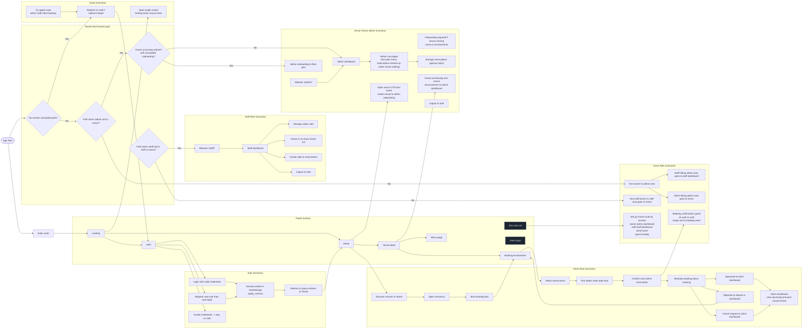

# Spotly Role Navigation Analysis

This diagram maps route-level behavior from router guards, page redirects, and role-driven actions.

## Roles covered

- Guest (no session)
- Client (authenticated, non-owner, non-staff)
- Venue Owner/Admin (email matches venue admin)
- Staff (email mapped in venue-staff records)
- System routing layer (guards, 404, route recovery)

## Mermaid Navigation Diagram (Landscape)

